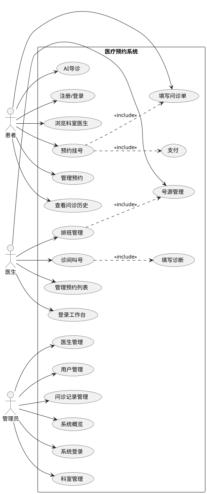

# 医疗预约挂号系统 —— 需求规格说明书

## 1. 引言

### 1.1 编写目的
本文档旨在明确医疗预约挂号系统的功能需求、非功能需求、系统用例及数据规范，为系统设计、开发、测试和验收提供依据。

### 1.2 项目背景
传统医院挂号存在排队时间长、号源不透明、就诊流程繁琐等问题。本项目开发一套线上医疗预约挂号系统，提供患者在线预约、医生排班管理、问诊记录等功能，提升就医效率和用户体验。

### 1.3 适用范围
- 患者用户（微信小程序端）
- 医生用户（PC浏览器端）
- 系统管理员（PC浏览器端）

### 1.4 术语定义
| 术语 | 说明 |
|------|------|
| 号源 | 医生在某个时间段的可预约数量 |
| 排班 | 医生在某天某时段的工作安排 |
| 问诊单 | 患者填写的症状信息及医生的诊断记录 |
| AI导诊 | 基于AI的症状分析和科室推荐 |

---

## 2. 功能需求

### 2.1 患者端（微信小程序）

| 编号 | 功能模块 | 功能描述 | 优先级 |
|------|---------|---------|:------:|
| FR-01 | 用户注册 | 手机号注册，填写姓名、身份证号 | 高 |
| FR-02 | 用户登录 | 手机号+密码登录 | 高 |
| FR-03 | 个人信息管理 | 查看/编辑姓名、身份证、头像上传 | 高 |
| FR-04 | 科室浏览 | 查看科室列表、搜索科室 | 高 |
| FR-05 | 医生浏览 | 按科室查看医生、搜索医生 | 高 |
| FR-06 | 预约挂号 | 选科室→日期→医生→时段→填问诊→提交 | 高 |
| FR-07 | 支付 | 模拟支付（挂起费支付） | 高 |
| FR-08 | 预约管理 | 查看预约列表、按状态筛选、取消预约 | 高 |
| FR-09 | 问诊单填写 | 填写问诊类型、主诉、现病史、既往史 | 高 |
| FR-10 | 问诊历史 | 查看历史问诊记录、详情、搜索 | 中 |
| FR-11 | AI导诊 | 输入症状，AI推荐科室，一键预约 | 中 |

### 2.2 医生端（PC浏览器）

| 编号 | 功能模块 | 功能描述 | 优先级 |
|------|---------|---------|:------:|
| FR-12 | 医生登录 | 工号+密码登录 | 高 |
| FR-13 | 工作台 | 今日概览统计、今日预约列表 | 高 |
| FR-14 | 排班管理 | 查看、新增、自动排班、清理过期 | 高 |
| FR-15 | 号源管理 | 发布号源、设置数量/费用、删除 | 高 |
| FR-16 | 诊间叫号 | 叫号、重叫、跳过、语音播报 | 高 |
| FR-17 | 问诊（填写诊断） | 查看患者问诊信息、填写检查/诊断/治疗方案 | 高 |
| FR-18 | 预约列表管理 | 查询(编号/姓名)、详情、编辑、取消 | 中 |
| FR-19 | 个人信息 | 查看/修改、修改密码 | 中 |

### 2.3 管理员端（PC浏览器）

| 编号 | 功能模块 | 功能描述 | 优先级 |
|------|---------|---------|:------:|
| FR-20 | 管理员登录 | 账号+密码登录 | 高 |
| FR-21 | 系统概览 | 科室/医生/用户/预约数量统计 | 高 |
| FR-22 | 科室管理 | 增删改查（含区域、诊室号） | 高 |
| FR-23 | 医生管理 | 增删改查（含性别）、自动排班 | 高 |
| FR-24 | 用户管理 | 增删改查、启用/禁用、按手机号/时间查询 | 高 |
| FR-25 | 问诊记录管理 | 查询、编辑完整信息、状态切换、删除 | 中 |
| FR-26 | 系统日志 | 操作日志查看 | 低 |
| FR-27 | 系统配置 | 参数设置 | 低 |

---

## 3. 非功能需求

| 编号 | 类型 | 需求描述 |
|------|------|---------|
| NFR-01 | 性能 | 页面加载时间不超过3秒 |
| NFR-02 | 性能 | 并发用户数支持≥100 |
| NFR-03 | 可用性 | 系统7×24小时运行，年度可用性≥99.5% |
| NFR-04 | 安全性 | 用户密码明文存储（课设阶段，生产应加密） |
| NFR-05 | 安全性 | 敏感配置（API Key）不提交到代码仓库 |
| NFR-06 | 兼容性 | 微信小程序兼容基础库3.0以上 |
| NFR-07 | 兼容性 | 管理端兼容Chrome/Firefox/Edge最新版 |
| NFR-08 | 易用性 | 界面简洁清晰，操作步骤不超过5步 |
| NFR-09 | 可维护性 | 代码分层清晰（Controller/Service/Mapper） |
| NFR-10 | 可扩展性 | 支持新增科室、医生、排班规则 |

---

## 4. 用例图

---

## 5. 数据字典

### 5.1 用户表 (user)

| 字段名 | 类型 | 长度 | 主键 | 说明 |
|--------|------|:----:|:----:|------|
| id | INT | - | PK | 用户ID，自增 |
| phone | VARCHAR | 20 | UNIQUE | 手机号（登录账号） |
| pwd | VARCHAR | 100 | - | 登录密码 |
| real_name | VARCHAR | 50 | - | 真实姓名 |
| id_card | VARCHAR | 100 | - | 身份证号 |
| avatar | VARCHAR | 500 | - | 头像URL |
| create_time | DATETIME | - | - | 注册时间 |
| update_time | DATETIME | - | - | 更新时间 |
| last_login_time | DATETIME | - | - | 最后登录时间 |
| status | TINYINT | - | - | 0=启用 1=禁用 |

### 5.2 科室表 (dept)

| 字段名 | 类型 | 长度 | 主键 | 说明 |
|--------|------|:----:|:----:|------|
| id | INT | - | PK | 科室ID，自增 |
| dept_name | VARCHAR | 50 | UNIQUE | 科室名称 |
| dept_desc | VARCHAR | 255 | - | 科室简介 |
| area | VARCHAR | 20 | - | 区域（如1区） |
| room_number | VARCHAR | 20 | - | 诊室号 |
| status | TINYINT | - | - | 0=启用 1=禁用 |
| create_time | DATETIME | - | - | 创建时间 |

### 5.3 医生表 (doctor)

| 字段名 | 类型 | 长度 | 主键 | 说明 |
|--------|------|:----:|:----:|------|
| id | INT | - | PK | 医生ID，自增 |
| work_no | VARCHAR | 20 | UNIQUE | 工号（登录账号） |
| name | VARCHAR | 50 | - | 姓名 |
| gender | VARCHAR | 10 | - | 性别 |
| title | VARCHAR | 50 | - | 职称 |
| dept_id | INT | - | FK | 所属科室ID |
| phone | VARCHAR | 100 | - | 电话 |
| intro | VARCHAR | 255 | - | 简介 |
| specialty | VARCHAR | 255 | - | 擅长 |
| pwd | VARCHAR | 100 | - | 登录密码 |
| status | TINYINT | - | - | 0=启用 1=禁用 |

### 5.4 排班表 (schedule)

| 字段名 | 类型 | 长度 | 主键 | 说明 |
|--------|------|:----:|:----:|------|
| id | INT | - | PK | 排班ID，自增 |
| doctor_id | INT | - | FK | 医生ID |
| visit_date | DATE | - | - | 就诊日期 |
| visit_time | VARCHAR | 50 | - | 就诊时段 |
| status | TINYINT | - | - | 0=已设置 1=停诊 |
| create_time | DATETIME | - | - | 创建时间 |

### 5.5 号源表 (number_source)

| 字段名 | 类型 | 长度 | 主键 | 说明 |
|--------|------|:----:|:----:|------|
| id | INT | - | PK | 号源ID，自增 |
| schedule_id | INT | - | FK | 排班ID |
| total_num | INT | - | - | 总号数 |
| remain_num | INT | - | - | 剩余号数 |
| fee | DECIMAL(10,2) | - | - | 费用 |
| status | TINYINT | - | - | 0=发布 1=下架 2=约满 3=结束 |

### 5.6 预约表 (appointment)

| 字段名 | 类型 | 长度 | 主键 | 说明 |
|--------|------|:----:|:----:|------|
| id | INT | - | PK | 预约ID，自增 |
| number_source_id | INT | - | FK | 号源ID |
| user_id | INT | - | FK | 用户ID |
| patient_name | VARCHAR | 50 | - | 患者姓名 |
| patient_id_card | VARCHAR | 100 | - | 患者身份证 |
| fee | DECIMAL(10,2) | - | - | 费用 |
| status | TINYINT | - | - | 0=待支付 1=待就诊 2=就诊中 3=已完成 4=已取消 |
| appointment_time | DATETIME | - | - | 预约时间 |
| pay_time | DATETIME | - | - | 支付时间 |

### 5.7 问诊单表 (consultation_form)

| 字段名 | 类型 | 长度 | 主键 | 说明 |
|--------|------|:----:|:----:|------|
| id | INT | - | PK | 问诊单ID，自增 |
| consultation_no | VARCHAR | 50 | UNIQUE | 问诊编号 |
| appointment_id | INT | - | FK,UNIQUE | 预约ID |
| user_id | INT | - | FK | 用户ID |
| doctor_id | INT | - | FK | 医生ID |
| form_type | VARCHAR | 50 | - | 问诊类型 |
| chief_complaint | VARCHAR | 1000 | - | 主诉 |
| present_illness | TEXT | - | - | 现病史 |
| past_history | TEXT | - | - | 既往史 |
| examination | TEXT | - | - | 检查 |
| diagnosis | TEXT | - | - | 诊断 |
| treatment | TEXT | - | - | 治疗方案 |
| status | TINYINT | - | - | 0=待诊断 1=已完成 |
| create_time | DATETIME | - | - | 创建时间 |

---

## 6. 系统边界与约束

- **前端技术栈**：微信小程序 + 纯HTML/JS（管理端/医生端）
- **后端技术栈**：Spring Boot + MyBatis + MySQL
- **运行环境**：Windows/Linux + JDK 8 + MySQL 8.0
- **部署方式**：单体应用（内嵌Tomcat）
- **外部依赖**：DeepSeek AI API（可选）

---

*文档版本：v1.0*
*最后更新：2026-07-03*
