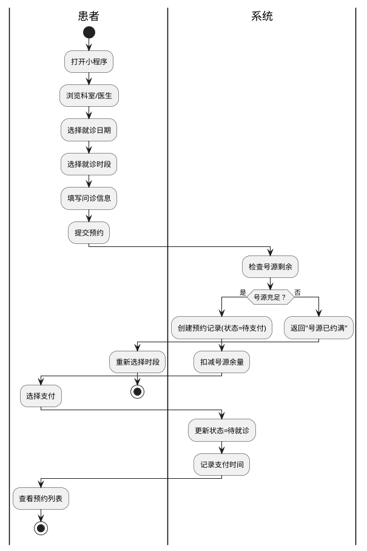
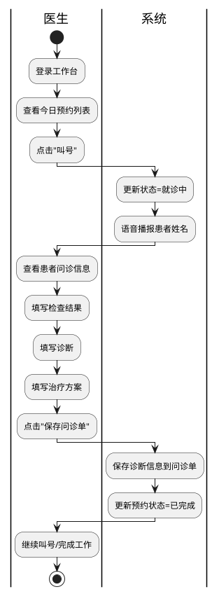
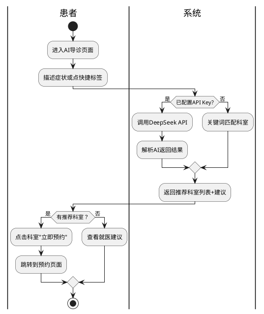

# 医疗预约挂号系统 —— 业务流程图

> 将以下 PlantUML 代码复制到 https://www.plantuml.com/ 或使用 IDEA PlantUML 插件查看

---

## 1. 预约挂号业务流程



---

## 2. 诊间叫号与问诊业务流程



---

## 3. 用户管理业务流程

```plantuml
@startuml
|管理员|
start
:登录管理系统;
:进入用户管理;
|管理员|
if (操作类型) as (操作类型)
case (查询)
  :输入手机号/姓名/时间范围;
  :点击查询;
  |系统|
  :筛选并返回用户列表;
  |管理员|
  :查看结果;
endcase
case (新增)
  :点击"新增用户";
  :填写姓名/手机/密码;
  :点击保存;
  |系统|
  :校验手机号唯一性;
  if (手机号已存在？) then (是)
    :返回错误提示;
    |管理员|
    :修改信息;
  else (否)
    :插入用户记录;
    :记录操作日志;
    :返回成功;
    |管理员|
    :查看新用户在列表中;
  endif
endcase
case (编辑)
  :点击用户"编辑"按钮;
  |系统|
  :返回用户信息;
  |管理员|
  :修改姓名/密码/状态;
  :点击保存;
  |系统|
  :更新用户信息;
  :记录操作日志;
endcase
case (删除)
  :点击"删除"按钮;
  :确认删除;
  |系统|
  :删除用户记录;
  :记录操作日志;
endcase
case (禁用/启用)
  :点击"禁用/启用"按钮;
  :确认操作;
  |系统|
  :更新用户状态;
  :记录操作日志;
endcase
endswitch
stop
@enduml
```

---

## 4. AI导诊业务流程



---

## 5. 排班管理业务流程

```plantuml
@startuml
|医生/管理员|
start
:进入排班管理;

if (排班方式) as (方式)
case (自动排班)
  :点击"自动排班";
  |系统|
  :遍历未来14天;
  :跳过休息日;
  :为每个时段创建排班;
  :为每个排班创建号源(20个);
  :返回创建结果;
endcase
case (手动排班)
  |医生|
  :选择日期、时段;
  :点击保存;
  |系统|
  :检查排班是否冲突;
  if (已存在?) then (是)
    :返回错误提示;
  else (否)
    :创建排班;
    :自动创建号源;
  endif
endcase
case (清理过期)
  |医生|
  :点击"清理过期排班";
  |系统|
  :删除今天之前的排班;
  :删除对应的号源;
  :删除无预约记录;
endcase
endswitch
stop
@enduml
```

---

## 6. 问诊记录管理业务流程

```plantuml
@startuml
|管理员|
start
:进入问诊记录管理;
:输入查询条件(医生/时间);
:点击查询;
|系统|
:查询问诊单列表(含JOIN);
:返回列表;
|管理员|
if (操作类型) as (操作)
case (查看)
  :点击"编辑";
  |系统|
  :返回完整问诊单信息;
  |管理员|
  :查看患者/医生/问诊/诊断信息;
endcase
case (修改诊断)
  :在编辑弹窗中修改诊断/治疗;
  :保存;
  |系统|
  :更新问诊单;
endcase
case (切换状态)
  :点击"设为已完成/待诊断";
  :确认;
  |系统|
  :更新问诊单状态;
endcase
case (删除)
  :点击"删除";
  :确认;
  |系统|
  :删除问诊单记录;
endcase
endswitch
stop
@enduml
```

---

## 7. 核心业务数据流

```plantuml
@startuml
actor 患者 as P
actor 医生 as D
actor 管理员 as A
database MySQL as DB

rectangle "预约流程" as AP {
  (1) P -> AP: 选择科室/医生/时段
  AP -> DB: 查询号源
  AP -> P: 展示可选号源
  P -> AP: 提交预约+问诊信息
  AP -> DB: 创建预约记录
  AP -> DB: 扣减号源
  AP -> P: 返回预约ID
  P -> AP: 支付
  AP -> DB: 更新支付状态
}

rectangle "问诊流程" as CF {
  D -> CF: 叫号
  CF -> DB: 查询患者预约
  CF -> D: 显示患者信息
  D -> CF: 填写诊断
  CF -> DB: 保存问诊单
  CF -> DB: 更新预约状态=已完成
}

rectangle "管理流程" as MG {
  A -> MG: 管理操作
  MG -> DB: CRUD操作
  DB --> MG: 返回结果
}
@enduml
```
