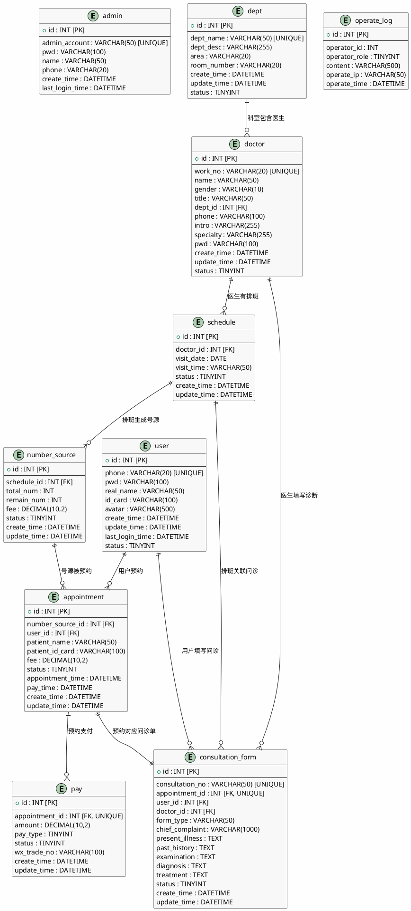

# 医疗预约挂号系统 —— 数据库设计文档

## 1. E-R 图

---

## 2. 表结构说明

数据库名：`hospital_registration_system`
字符集：`utf8mb4`，排序规则：`utf8mb4_unicode_ci`

### 2.1 admin（管理员表）

| 字段 | 类型 | 约束 | 说明 |
|------|------|:----:|------|
| id | INT | PK, AUTO_INCREMENT | 管理员ID |
| admin_account | VARCHAR(50) | UNIQUE, NOT NULL | 管理员账号 |
| pwd | VARCHAR(100) | NOT NULL | 密码 |
| name | VARCHAR(50) | NOT NULL | 管理员姓名 |
| phone | VARCHAR(20) | NOT NULL | 手机号 |
| create_time | DATETIME | DEFAULT CURRENT_TIMESTAMP | 创建时间 |
| last_login_time | DATETIME | - | 最后登录时间 |

### 2.2 user（用户表）

| 字段 | 类型 | 约束 | 说明 |
|------|------|:----:|------|
| id | INT | PK, AUTO_INCREMENT | 用户ID |
| phone | VARCHAR(20) | UNIQUE | 手机号（登录账号） |
| pwd | VARCHAR(100) | NOT NULL | 密码 |
| real_name | VARCHAR(50) | NOT NULL | 真实姓名 |
| id_card | VARCHAR(100) | NOT NULL | 身份证号 |
| avatar | VARCHAR(500) | - | 头像URL |
| create_time | DATETIME | CURRENT_TIMESTAMP | 注册时间 |
| update_time | DATETIME | - | 更新时间 |
| last_login_time | DATETIME | - | 最后登录时间 |
| status | TINYINT | DEFAULT 0 | 0=启用 1=禁用 |

### 2.3 dept（科室表）

| 字段 | 类型 | 约束 | 说明 |
|------|------|:----:|------|
| id | INT | PK, AUTO_INCREMENT | 科室ID |
| dept_name | VARCHAR(50) | UNIQUE | 科室名称 |
| dept_desc | VARCHAR(255) | - | 科室简介 |
| area | VARCHAR(20) | - | 区域（如1区） |
| room_number | VARCHAR(20) | - | 诊室号 |
| create_time | DATETIME | CURRENT_TIMESTAMP | 创建时间 |
| update_time | DATETIME | - | 更新时间 |
| status | TINYINT | DEFAULT 0 | 0=启用 1=禁用 |

### 2.4 doctor（医生表）

| 字段 | 类型 | 约束 | 说明 |
|------|------|:----:|------|
| id | INT | PK, AUTO_INCREMENT | 医生ID |
| work_no | VARCHAR(20) | UNIQUE | 工号 |
| name | VARCHAR(50) | NOT NULL | 姓名 |
| gender | VARCHAR(10) | NOT NULL | 性别 |
| title | VARCHAR(50) | NOT NULL | 职称 |
| dept_id | INT | FK→dept.id | 所属科室 |
| phone | VARCHAR(100) | NOT NULL | 电话 |
| intro | VARCHAR(255) | - | 简介 |
| specialty | VARCHAR(255) | - | 擅长领域 |
| pwd | VARCHAR(100) | NOT NULL | 密码 |
| create_time | DATETIME | CURRENT_TIMESTAMP | 创建时间 |
| update_time | DATETIME | - | 更新时间 |
| status | TINYINT | DEFAULT 0 | 0=启用 1=禁用 |

### 2.5 schedule（排班表）

| 字段 | 类型 | 约束 | 说明 |
|------|------|:----:|------|
| id | INT | PK, AUTO_INCREMENT | 排班ID |
| doctor_id | INT | FK→doctor.id | 医生ID |
| visit_date | DATE | NOT NULL | 就诊日期 |
| visit_time | VARCHAR(50) | NOT NULL | 就诊时段 |
| status | TINYINT | DEFAULT 0 | 0=已设置 1=临时停诊 |
| create_time | DATETIME | CURRENT_TIMESTAMP | 创建时间 |
| update_time | DATETIME | - | 更新时间 |

### 2.6 number_source（号源表）

| 字段 | 类型 | 约束 | 说明 |
|------|------|:----:|------|
| id | INT | PK, AUTO_INCREMENT | 号源ID |
| schedule_id | INT | FK→schedule.id | 排班ID |
| total_num | INT | NOT NULL | 总号数 |
| remain_num | INT | NOT NULL | 剩余号数 |
| fee | DECIMAL(10,2) | NOT NULL | 费用 |
| status | TINYINT | DEFAULT 0 | 0=发布 1=下架 2=约满 3=结束 |
| create_time | DATETIME | CURRENT_TIMESTAMP | 创建时间 |
| update_time | DATETIME | - | 更新时间 |

### 2.7 appointment（预约表）

| 字段 | 类型 | 约束 | 说明 |
|------|------|:----:|------|
| id | INT | PK, AUTO_INCREMENT | 预约ID |
| number_source_id | INT | FK→number_source.id | 号源ID |
| user_id | INT | FK→user.id | 用户ID |
| patient_name | VARCHAR(50) | NOT NULL | 患者姓名 |
| patient_id_card | VARCHAR(100) | NOT NULL | 患者身份证 |
| fee | DECIMAL(10,2) | NOT NULL | 费用 |
| status | TINYINT | DEFAULT 0 | 0=待支付 1=待就诊 2=就诊中 3=已完成 4=已取消 |
| appointment_time | DATETIME | CURRENT_TIMESTAMP | 预约时间 |
| pay_time | DATETIME | - | 支付时间 |
| create_time | DATETIME | CURRENT_TIMESTAMP | 创建时间 |
| update_time | DATETIME | - | 更新时间 |

### 2.8 consultation_form（问诊单表）

| 字段 | 类型 | 约束 | 说明 |
|------|------|:----:|------|
| id | INT | PK, AUTO_INCREMENT | 问诊单ID |
| consultation_no | VARCHAR(50) | UNIQUE | 问诊编号(CF+时间戳) |
| appointment_id | INT | FK→appointment.id, UNIQUE | 预约ID |
| user_id | INT | FK→user.id | 用户ID |
| doctor_id | INT | FK→doctor.id | 医生ID |
| form_type | VARCHAR(50) | - | 问诊类型(初诊/复诊/急诊) |
| chief_complaint | VARCHAR(1000) | - | 主诉 |
| present_illness | TEXT | - | 现病史 |
| past_history | TEXT | - | 既往史 |
| examination | TEXT | - | 检查 |
| diagnosis | TEXT | - | 诊断 |
| treatment | TEXT | - | 治疗方案 |
| status | TINYINT | DEFAULT 0 | 0=待诊断 1=已完成 |
| create_time | DATETIME | CURRENT_TIMESTAMP | 创建时间 |
| update_time | DATETIME | - | 更新时间 |

---

## 3. 索引设计

| 表名 | 索引名 | 字段 | 类型 | 说明 |
|------|--------|------|:----:|------|
| user | idx_user_phone | phone | UNIQUE | 手机号登录查询 |
| user | idx_user_status | status | INDEX | 按状态筛选 |
| doctor | idx_doctor_work_no | work_no | UNIQUE | 工号登录 |
| doctor | idx_doctor_dept_id | dept_id | INDEX | 按科室查医生 |
| schedule | idx_schedule_doctor_date | doctor_id, visit_date | INDEX | 查医生某天排班 |
| number_source | idx_ns_schedule_id | schedule_id | INDEX | 查排班号源 |
| appointment | idx_apt_user_id | user_id | INDEX | 查用户预约 |
| appointment | idx_apt_number_source | number_source_id | INDEX | 号源预约情况 |
| consultation_form | idx_cf_appointment | appointment_id | UNIQUE | 预约关联问诊单 |
| consultation_form | idx_cf_user_id | user_id | INDEX | 查用户问诊历史 |
| consultation_form | idx_cf_doctor_id | doctor_id | INDEX | 查医生问诊记录 |
| operate_log | idx_log_operator | operator_id | INDEX | 按操作者查日志 |

---

## 4. 外键约束

| 表 | 外键字段 | 引用表 | 引用字段 |
|----|---------|--------|---------|
| doctor | dept_id | dept | id |
| schedule | doctor_id | doctor | id |
| number_source | schedule_id | schedule | id |
| appointment | number_source_id | number_source | id |
| appointment | user_id | user | id |
| consultation_form | appointment_id | appointment | id |
| consultation_form | user_id | user | id |
| consultation_form | doctor_id | doctor | id |
| pay | appointment_id | appointment | id |

---

## 5. 数据量预估

| 表 | 预估行数 | 说明 |
|---|:--------:|------|
| user | 5000+ | 注册用户 |
| dept | 20+ | 科室 |
| doctor | 100+ | 医生 |
| schedule | 5000+/月 | 排班 |
| number_source | 20000+/月 | 号源 |
| appointment | 10000+/月 | 预约 |
| consultation_form | 5000+/月 | 问诊单 |
